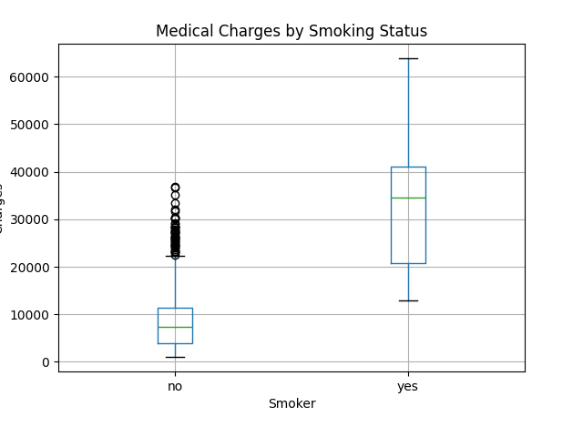
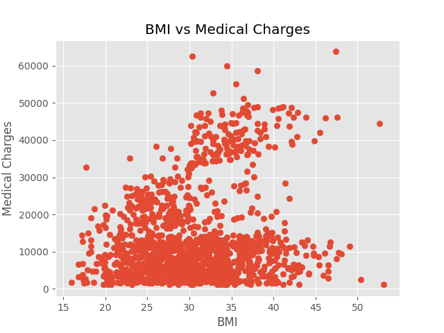
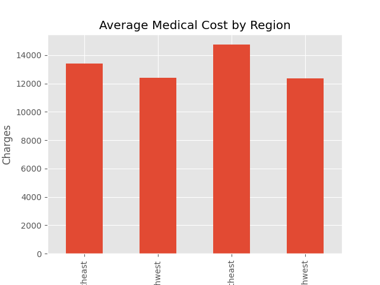

# Healthcare Cost Data Analysis

## Project Overview
This project analyzes a healthcare insurance dataset to understand factors influencing medical costs.

The dataset contains 1338 patient records with information on age, BMI, smoking status, region, and insurance charges.

## Tools Used
- Python
- Pandas
- Matplotlib

## Dataset Features
- Age of the patient
- Gender
- BMI (Body Mass Index)
- Number of children
- Smoking status
- Region
- Medical insurance charges

## Analysis Performed
1. Exploratory Data Analysis (EDA)
2. Statistical summary of healthcare costs
3. Comparison of medical charges for smokers vs non-smokers
4. Relationship between BMI and medical costs
5. Regional variation in healthcare charges

## Key Insights
- Smokers have significantly higher healthcare costs compared to non-smokers.
- Higher BMI values are associated with increased medical charges.
- Healthcare costs vary across different regions.

## Visualizations
# Healthcare Cost Data Analysis

## Project Overview
This project analyzes a healthcare insurance dataset to understand factors influencing medical costs.

The dataset contains 1338 patient records with information on age, BMI, smoking status, region, and insurance charges.

## Tools Used
- Python
- Pandas
- Matplotlib

## Dataset Features
- Age of the patient
- Gender
- BMI (Body Mass Index)
- Number of children
- Smoking status
- Region
- Medical insurance charges

## Analysis Performed
1. Exploratory Data Analysis (EDA)
2. Statistical summary of healthcare costs
3. Comparison of medical charges for smokers vs non-smokers
4. Relationship between BMI and medical costs
5. Regional variation in healthcare charges

## Key Insights
- Smokers have significantly higher healthcare costs compared to non-smokers.
- Higher BMI values are associated with increased medical charges.
- Healthcare costs vary across different regions.

## Visualizations
### Medical Charges by Smoking Status

### BMI vs Medical Charges

### Average Medical Cost by Region
